<div align="center">

<a href="https://azi36.com">
  
</a>

<a href="https://azi36.com"></a>

</div>

<br>

<details>
<summary>🥚 man azi36</summary>
<br>

```text
$ man azi36
未找到手册页：此人拒绝被文档化。

$ sudo man azi36
好吧。用法：azi36 [--慢慢做] <喜欢的东西>
已知缺陷：灵感余额经常不足（见 --force）。
```

</details>

<details>
<summary>🔧 改完记得体检</summary>
<br>

十几个手写 HTML，共享同一份 `style.css` / `site.js`，最容易出的事是「改了一页，忘了另外十三页」。
提交前跑一下，导航少了频道、版本号分叉、分享卡片漏了、站内链接指错，它都会指名道姓地报出来：

```bash
node tools/check.mjs                  # 体检
node tools/check.mjs --write-sitemap  # 顺手重生成 sitemap.xml
```

新增页面时，把它登记进 `tools/check.mjs` 顶部的 `PAGES`，其余检查会自动覆盖到它。
push 到 main 也会自动跑一遍（`.github/workflows/check.yml`），红叉不拦上线，只负责提醒。

</details>

<div align="center">
<sub>想法上的巨人，行动上的矮子——但网站好歹是上线了。</sub>
</div>
